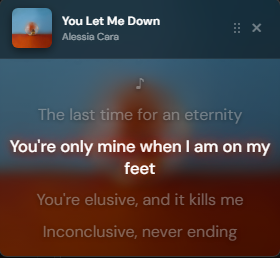

# Lyric Miniplayer

[](https://discord.gg/RCsyek5HY)
[](https://github.com/FO-SS/Spictify-Lyric-Miniplayer/stargazers)

A Spicetify extension that creates a **floating Picture-in-Picture lyrics window** that stays on top of other applications — like YouTube's mini-player, but for lyrics!



## New in v2

- **Lyrics Only Mode** — Hide everything except the lyrics for a clean, minimal overlay. Hover the window to reveal settings/close, or double-click the lyrics to toggle the mode
- **Free Scroll + Resume Sync** — Scroll through the lyrics whenever you want; auto-tracking pauses and a **"↓ Resume sync"** button appears to jump back to the live line
- **Repeat Button** — Cycle Repeat Off → All → One right from the miniplayer (with its own show/hide toggle in settings)
- **Progress Bar** — See the track position and drag to seek, with timestamps
- **Dynamic Theme (new default)** — The window takes on the song's blurred cover art, with a highlight color pulled from the artwork that changes with every track
- **Smoother Interface** — Spotify-style control layout, soft fade at the lyrics edges, lyrics that center on the first/last lines, and lighter under-the-hood updates

### Fixes

- **Lyrics work again on Spotify 1.3+** — A recent Spotify/Spicetify update stopped lyrics from loading, even for songs that have them. The miniplayer now uses Spotify's current way of loading lyrics, with fallbacks for older versions
- **Word-by-word synced lyrics** now scroll along with the song too
- **Settings in Lyrics Only Mode** — The top bar with the settings button now shows whenever the mouse is over the window, even over empty space, and the settings panel no longer turns see-through while lyrics are scrolling
- **Resume sync button** no longer hides behind the controls when they're showing
- Removed a thin gap above the header, and the default lyrics size is now a little larger (16px)

## Features

- **Floating Window** — Opens lyrics in a separate always-on-top window
- **Synced Lyrics** — Automatically highlights and scrolls to the current line
- **Lyrics Only Mode** — Distraction-free view with just the lyrics
- **Free Scroll & Resume** — Browse ahead or behind, then snap back to the current line
- **Playback Controls** — Shuffle, Previous, Play/Pause, Next, Repeat buttons
- **Repeat Button** — Toggle Repeat Off / All / One
- **Like Button** — Save songs to your Liked Songs directly from the miniplayer
- **Progress Bar** — Seekable track progress with timestamps
- **Volume Control** — Adjust volume with slider, click speaker to mute
- **Adjustable Font Size** — Slider to make lyrics larger or smaller
- **13 Beautiful Themes** — Dynamic (cover art), Spotify, Pink Pop, Kawaii, Ocean Blue, Racing Red, Sunset, Galaxy, Mint Fresh, Luxury Gold, Cyberpunk, Frost, Rose Gold
- **Dynamic Theme** — Blurred album art background with an accent color extracted from the artwork, refreshed on every song
- **Center/Left Align** — Toggle between centered or left-aligned lyrics
- **Click to Seek** — Click any lyric line to jump to that part of the song
- **Full Settings Panel** — Customize everything to your liking
- **Remembers Preferences** — All settings are saved automatically

## Installation

### From Spicetify Marketplace (Recommended)

1. Open Spotify
2. Go to the Marketplace
3. Search for "Lyric Miniplayer"
4. Click Install

### Manual Installation

1. Download `lyrics-overlay.js`
2. Copy to your Spicetify Extensions folder:
   - **Windows:** `%appdata%\spicetify\Extensions\`
   - **macOS/Linux:** `~/.config/spicetify/Extensions/`
3. Run:
   ```bash
   spicetify config extensions lyrics-overlay.js
   spicetify apply
   ```
4. Restart Spotify

## Usage

1. **Click the music note icon** in Spotify's top bar

2. A floating window will appear with your lyrics!

3. **Click the ⠿ dots** in the header to open settings

### Lyrics Only Mode

- Turn it on in **Settings → Lyrics Only Mode**, or **double-click** anywhere on the lyrics
- The header and footer disappear — just lyrics on a clean background
- **Hover anywhere on the window** to reveal the playback controls at the bottom, plus the settings (gear) and close buttons at the top
- **Move the window** by dragging anywhere on the background (anywhere that isn't a lyric line), the top hover bar, or the left/right window edges
- Press **Escape**, double-click the lyrics again, or toggle the setting off to exit

### Scrolling Through Lyrics

- **Scroll freely** with your mouse wheel or trackpad to read ahead or look back — auto-tracking pauses automatically
- A **"↓ Resume sync"** button appears at the bottom; click it to jump back to the current line and resume tracking
- Tracking also resumes automatically when the song changes
- **Click any line** to seek the song to that lyric

## Themes

Choose from **13 beautiful themes**:

| Theme | Preview |
|-------|---------|
| Dynamic *(default)* | Blurred cover art background + accent color pulled from the artwork, changes with every song |
| Spotify | Classic green accent |
| Pink Pop | Vibrant pink |
| Kawaii | Soft pastel pink |
| Ocean Blue | Cool blue tones |
| Racing Red | Bold red |
| Sunset | Warm orange |
| Galaxy | Purple magic |
| Mint Fresh | Fresh teal |
| Luxury Gold | Elegant gold |
| Cyberpunk | Neon magenta |
| Frost | Icy light blue |
| Rose Gold | Romantic rose |

**To change theme:** Settings → Click the theme button → Choose your theme

## Settings & Display Options

Click the **⠿** in the header (or the **gear** button on the hover bar in Lyrics Only Mode) to access settings:

### Theme
- Click to open the theme picker
- Choose from 13 themes
- Changes apply instantly

### Display Options
| Toggle | Description |
|--------|-------------|
| **Lyrics Only Mode** | Hide everything except the lyrics |
| **Center Lyrics** | Toggle centered or left-aligned lyrics |

### Control Options
| Toggle | Description |
|--------|-------------|
| **Auto-Hide Controls** | Fade the controls & sliders out when the mouse leaves the window; hover to reveal (on by default) |
| **Shuffle Button** | Show/hide shuffle button in controls |
| **Repeat Button** | Show/hide the repeat button |
| **Like Button** | Show/hide the heart button |
| **Close Button** | Show/hide the × close button |
| **Progress Bar** | Show/hide the seekable progress bar |
| **Font Size Slider** | Show/hide the font size control (off by default) |
| **Volume Slider** | Show/hide the volume control |

All preferences are saved and persist between sessions.

## Controls

| Control | Action |
|---------|--------|
| Shuffle | Toggle shuffle |
| Previous | Previous track |
| Play/Pause | Play/Pause |
| Next | Next track |
| Repeat | Cycle Repeat Off → All → One |
| Heart | Like/Unlike song |
| Progress Bar | Drag to seek |
| Close | Close miniplayer |

## Troubleshooting

### Lyrics not showing?
- Some tracks don't have lyrics available on Spotify
- Lyrics are a Spotify feature (availability varies by region)
- If lyrics stopped loading for **every** song after a Spotify or Spicetify update, update the extension to the latest version from the Marketplace, then run `spicetify apply`

### Window not appearing?
- Click the music note icon in Spotify's top bar
- Check if popups are blocked in your system

### Extension not loading?
1. Verify the file is in the correct Extensions folder
2. Run `spicetify config extensions lyrics-overlay.js`
3. Run `spicetify apply`
4. Restart Spotify completely

## Uninstall

```bash
spicetify config extensions lyrics-overlay.js-
spicetify apply
```

## License

MIT License — Feel free to modify and share!

## Credits

- Built for [Spicetify](https://spicetify.app/)
- Uses Spotify's lyrics API
- Font: [DM Sans](https://fonts.google.com/specimen/DM+Sans)
